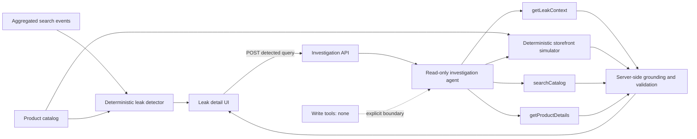

# Carcarah

Autonomous Search Revenue Recovery Agent.

## Problem

E-commerce stores lose revenue when high-intent searches return irrelevant results, poorly ranked products, or no useful result. The catalog may already contain a suitable product, but shoppers still fail to find it.

## Vision and current milestone

Carcarah is designed around this loop:

**Observe → Detect → Investigate → Act → Validate → Measure**

The current milestone implements **Observe + Detect + Investigate**. Detection is deterministic. Investigation uses a real tool-calling agent to inspect one detected leak, test its own search-term hypotheses, ground related products in catalog data, and recommend a next action.

The agent is intentionally read-only. It cannot create synonyms, boost products, or change storefront configuration. Those capabilities belong to a future Act milestone.

## Demo behavior

The demo contains 28 fictional fashion products and 22 aggregated search queries. Its primary case is `moletom canguru preto`: the query has 187 searches, 2 clicks, no purchases, and the deterministic storefront simulator returns no products. The catalog does contain relevant products under different vocabulary, but no product metadata or code contains a planted mapping from that query to those products.

All catalog, search, and GMV data is simulated.

## Architecture



- `data/`: simulated catalog and aggregated search events.
- `src/lib/search-analysis/`: pure metrics, baselines, leak detection, severity, and opportunity calculations.
- `src/lib/commerce-search/`: deterministic lexical storefront and catalog search simulator.
- `src/lib/investigation-agent/`: AI SDK runtime, structured result schema, read tools, trace, and server-side grounding.
- `src/app/api/investigate/`: endpoint that accepts only currently detected leaks.
- `src/components/investigation-panel.tsx`: idle, investigating, completed, error, and unconfigured UI states.

### Deterministic detection

A query becomes a candidate when it has at least 50 searches, conversion below 45% of the healthy-query baseline, and either low CTR or zero purchases. Severity combines volume, CTR gap, conversion gap, zero purchases, and current storefront result count. No query string is hardcoded in the detector.

### Estimated GMV opportunity

The estimate is incremental:

```text
searches × max(0, baseline conversion rate - current conversion rate) × relevant average order value
```

Relevant AOV is the average price of the current in-stock storefront results for that query. When the storefront returns no result, the documented demo fallback is the average price of all in-stock catalog products. Every input is clamped at zero or greater.

This value is always an **Estimated GMV opportunity**. It is not recovered, guaranteed, or realized revenue.

### Investigation agent

The server uses the Vercel AI SDK, the OpenAI Responses provider, `gpt-5.6-sol`, and a Zod-validated `InvestigationResult`. The agent chooses alternative catalog search terms, while the application controls tool scope and validates the response.

Available read tools:

- `getLeakContext`
- `searchStorefront`
- `searchCatalog`
- `getProductDetails`

The server rejects unknown product IDs, requires related products to have been discovered and inspected, requires recommended synonym targets to have been searched, and replaces model-provided evidence and product facts with values observed from actual tool calls. The response includes a trace built only from executed tools.

There are no write tools in this milestone.

## Running locally

Requirements: Node.js 20.9 or newer and npm.

```bash
npm install
copy .env.example .env.local
npm run dev
```

Set `OPENAI_API_KEY` in `.env.local` to enable investigation. Without a key, the dashboard and deterministic detection continue to work, and the investigation control clearly reports that agent configuration is required. It never substitutes a fake investigation.

Open [http://localhost:3000](http://localhost:3000).

Quality checks:

```bash
npm run lint
npm test
npm run build
```

## Disclaimer

GMV opportunity metrics and agent recommendations are based on simulated demo data. A recommendation is not an executed storefront change.
