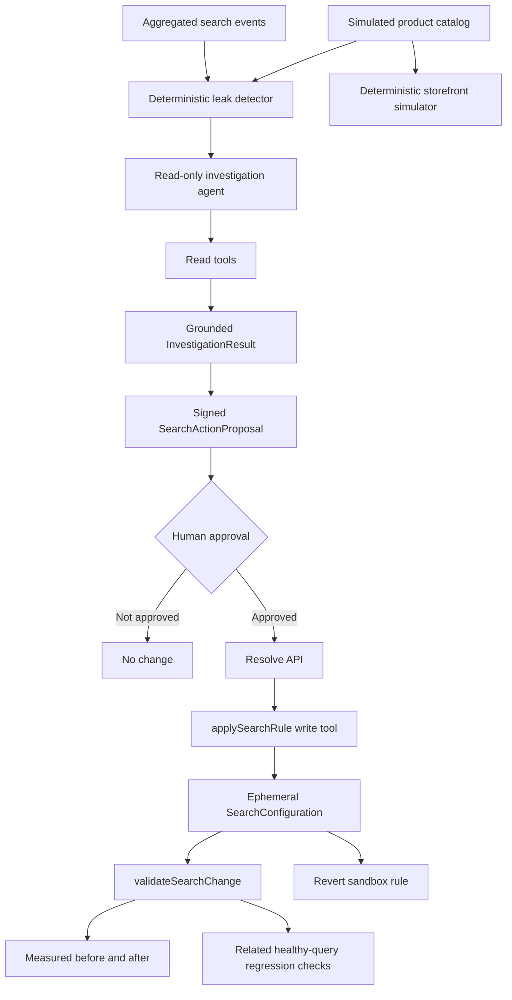

# Carcarah

Autonomous Search Revenue Recovery Agent.

## Current milestone

Carcarah now demonstrates this controlled loop:

**Observe → Detect → Investigate → Act → Validate**

The detector and financial metrics remain deterministic. An OpenAI tool-calling agent performs semantic investigation with read-only tools. A search change is proposed separately, requires explicit human approval, runs only in an ephemeral demo sandbox, and is automatically validated before it is presented as successful.

No catalog, production search engine, analytics source, or commerce platform is modified.

## Demo behavior

The primary simulated case is `moletom canguru preto`:

1. The original deterministic storefront returns no products.
2. Carcarah investigates the leak and tests catalog search hypotheses.
3. The investigation may produce a minimal, reversible `SearchActionProposal` supported by inspected products.
4. A human clicks **Approve & apply in demo sandbox**.
5. The server verifies the signed proposal, applies it through the Act write tool, reruns the original query, and checks related healthy queries for regressions.
6. The UI displays the measured before/after result and allows the sandbox rule to be reverted.

The relationship between shopper vocabulary and catalog vocabulary is not stored in product metadata, a synonym table, the prompt, or production code. The model must infer a hypothesis during each real investigation.

All catalog, search, and GMV data is simulated.

## Architecture



### Deterministic layer

- `src/lib/search-analysis/` calculates baselines, leak severity, and incremental Estimated GMV opportunity.
- `src/lib/commerce-search/` performs lexical storefront and catalog search. `searchStorefront(query, products, config)` applies optional sandbox rules before matching real catalog products.
- The opportunity formula remains:

```text
searches × max(0, baseline conversion rate - current conversion rate) × relevant average order value
```

This is always an **Estimated GMV opportunity**, never recovered or guaranteed revenue.

### Investigation

`src/lib/investigation-agent/` uses the Vercel AI SDK, the OpenAI Responses provider, `gpt-5.6-sol`, and Zod structured output. Its tools remain read-only:

- `getLeakContext`
- `searchStorefront`
- `searchCatalog`
- `getProductDetails`

Catalog search hypotheses are distinct from the executable rule. When evidence supports a safe search change, the result contains a minimal `SearchActionProposal` with type, source, targets, demo scope, confidence, risk, reversibility, and rationale.

The server grounds every product and target in actual tool results, applies risk policy, and signs the approved proposal. The browser cannot change its source, targets, confidence, or risk without invalidating that authorization.

### Act sandbox

`src/lib/search-actions/` owns the Act boundary:

- `SearchConfiguration` stores only sandbox synonym and query-rewrite rules.
- `applySearchRule()` is the only Act write tool.
- The tool cannot edit products, metrics, search events, or external systems.
- Every applied rule records its collection, source, targets, and deterministic rule ID.
- `revertSearchRule()` removes that rule and confirms the original storefront behavior is restored.

`POST /api/resolve` accepts only a currently detected leak and a signed proposal returned by its investigation. It rejects malformed input, altered browser payloads, unsupported targets, and high-risk actions. Low-risk actions can be applied after human approval. Medium-risk actions show a warning but can be previewed in the sandbox. High-risk actions are blocked.

### Validation and regression checks

`validateSearchChange()` compares the original query with an empty configuration and the updated sandbox configuration. Validation passes only when result count improves, new catalog products appear, and no related healthy query degrades.

Related healthy queries are selected generically from the simulated search-event dataset by shared normalized tokens. The action trace is assembled only as backend operations execute.

## Running locally

Requirements: Node.js 22 or newer and npm.

```bash
npm install
copy .env.example .env.local
npm run dev
```

Set `OPENAI_API_KEY` in `.env.local` to enable investigation. `CARCARAH_APPROVAL_SECRET` is optional for the local demo and otherwise falls back to `OPENAI_API_KEY` for signing short-lived action approvals.

Without an API key, deterministic detection and the dashboard still work. No fake investigation or action is generated.

Quality checks:

```bash
npm run lint
npm test
npm run build
```

## Scope and disclaimer

This milestone does not add authentication, a database, embeddings, RAG, multiple agents, external analytics, or Shopify/VTEX integrations. Applied rules exist only in the response-scoped demo sandbox.

GMV opportunity metrics and agent recommendations use simulated data. A resolved sandbox leak means the deterministic search experience improved in validation; it does not mean revenue was recovered.
