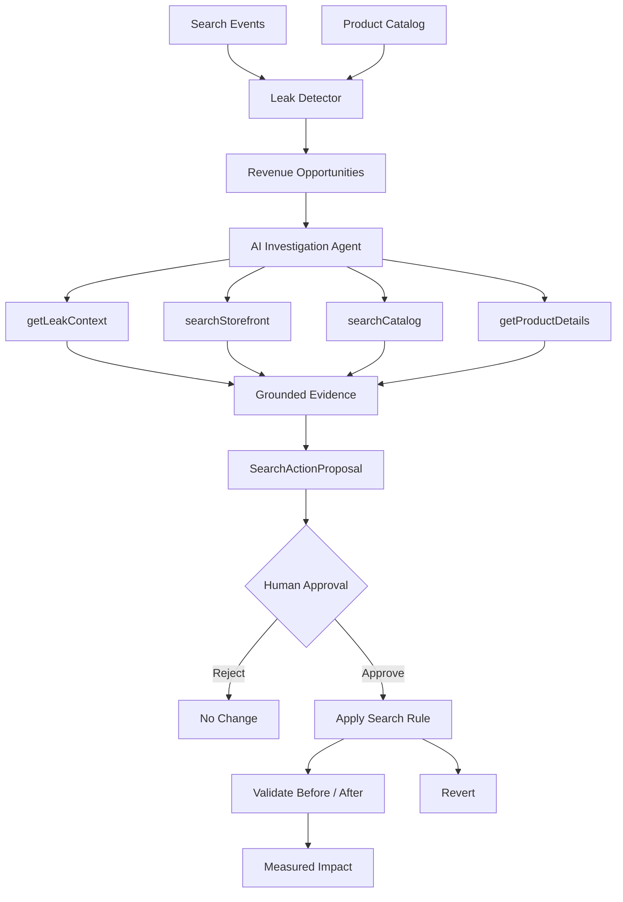

# Carcarah

An AI agent that finds and recovers lost e-commerce search opportunities.

Detect revenue leaks, investigate root causes using real tools, propose safe search fixes, require human approval, and validate the impact before deployment.

## The problem

A customer searches for **"moletom canguru preto"**.

The store already has relevant black hoodies in stock, but the search engine returns **0 products found** because the catalog uses different vocabulary.

That means:
- high search demand,
- zero purchases,
- and revenue opportunities that often go unnoticed.

Most e-commerce teams discover these problems manually, after conversion has already been lost.

## The solution

**Carcarah** is an autonomous AI agent for e-commerce search recovery.

It performs the complete recovery loop:

```
Detect
   ↓
Investigate
   ↓
Propose
   ↓
Human approval
   ↓
Apply
   ↓
Validate
```

Instead of only showing analytics, Carcarah **investigates** the search failure using real tools, explores the catalog, identifies the root cause, proposes a reversible search rule, and validates the result after the change is applied.

## Before → After

<p align="center">
  
</p>

```
Search: "moletom canguru preto"

❌ BEFORE
0 products found
187 searches
0 purchases

        ↓ Carcarah investigates ↓

✅ AFTER
Relevant hoodies found
Synonym rule: "canguru" → "hoodie"
Validated with regression checks
```

The storefront shown in the demo uses the same search engine before and after the approved rule is applied.

## Live demo

- **Dashboard:** https://carcarah.vercel.app
- **NOVA storefront:** https://carcarah.vercel.app/storefront
- **Demo video:** https://youtu.be/oS5YGFwUD4w

Try the complete flow:
1. Open the dashboard
2. Select the search leak
3. Investigate with Carcarah
4. Review the diagnosis
5. Approve the proposed rule
6. Validate the result
7. Open the storefront and compare the search outcome

## How Carcarah works

### 1. Deterministic leak detection

Carcarah continuously analyzes search analytics and identifies queries with:
- high search volume,
- low conversion,
- missing or weak search results,
- and estimated revenue opportunity.

The detector is deterministic and fully reproducible.

### 2. Agentic investigation

Once a leak is detected, an AI agent begins a real investigation.

The agent uses **read-only tools:**
- `getLeakContext`
- `searchStorefront`
- `searchCatalog`
- `getProductDetails`

It does not receive the answer in advance.

It must explore the storefront, generate vocabulary hypotheses, inspect products, and produce a grounded diagnosis based on actual tool execution.

### 3. Safe proposal generation

The agent outputs a structured `SearchActionProposal` containing:
- source term,
- target terms,
- confidence,
- risk level,
- rationale,
- and reversibility.

Example:
```json
{
  "type": "synonym_rule",
  "source": "canguru",
  "targets": ["hoodie"],
  "confidence": 0.92,
  "risk": "low",
  "reversible": true
}
```

### 4. Human approval

No executable action happens automatically.

Every proposal requires **explicit human approval.**

Approvals are cryptographically signed and bound to the investigated proposal, preventing client-side tampering.

### 5. Validation and regression checks

After approval, Carcarah applies the rule in an isolated demo environment, re-runs the original search, measures the improvement, and checks healthy queries for regressions.

Validation trace:
```
✓ Rule applied
✓ Query re-tested
✓ Results measured
✓ Regression checks passed
✓ Change validated
```

### 6. Revert

Every applied rule can be reverted immediately, restoring the original storefront behavior.

## Architecture



## Tech stack

### Application
- Next.js 16
- React 19
- TypeScript
- CSS Modules
- Motion

### AI
- Vercel AI SDK
- OpenAI Responses API
- GPT-4o
- Zod structured output
- Tool calling

### Quality
- Vitest
- ESLint
- TypeScript
- Next.js production build

## Why this is an AI agent

The detector itself is deterministic.

The **investigation is autonomous.**

Carcarah must:
- inspect analytics,
- test the current search behavior,
- generate vocabulary hypotheses,
- explore the catalog,
- inspect products,
- produce a grounded diagnosis,
- and propose a safe action.

The interface displays only real backend tool executions, not a pre-scripted animation.

## Running locally

### Requirements
- Node.js 22+
- npm
- OpenAI API key

### Setup

```bash
git clone https://github.com/guicaettano/carcarah.git
cd carcarah

npm install

cp .env.example .env.local
```

Configure:
```env
OPENAI_API_KEY=your_key_here
CARCARAH_APPROVAL_SECRET=optional_secret
```

Start the app:
```bash
npm run dev
```

Open:
```
http://localhost:3000
```

Quality checks:
```bash
npm test
npm run lint
npm run build
```

## Project structure

```
src/
├── app/
│   ├── api/
│   │   ├── investigate/
│   │   ├── resolve/
│   │   └── storefront/
│   ├── leaks/
│   └── storefront/
│
├── lib/
│   ├── search-analysis/
│   ├── investigation-agent/
│   ├── search-actions/
│   ├── commerce-search/
│   └── storefront-demo/
│
└── components/

data/
├── products.json
└── search-events.json
```

## Current scope

This hackathon version intentionally focuses on the complete autonomous decision loop.

**Included:**
- deterministic leak detection,
- AI investigation,
- grounded tool execution,
- structured proposals,
- signed approvals,
- controlled search actions,
- validation,
- regression checks,
- revert,
- and the NOVA storefront demo.

**Not included:**
- production platform integrations,
- authentication,
- persistent multi-tenant infrastructure,
- real catalog modification,
- automatic deployment to production search engines.

## Disclaimer

This is a hackathon demo.

All data is synthetic.

GMV values represent estimated revenue opportunities.

Search rules affect only the isolated demo environment for the current session.

No production e-commerce system is modified.

---

Built for the **Agents for Commerce** hackathon by **Guilherme da Mata**.

Carcarah helps e-commerce teams find the searches that are quietly losing sales.
