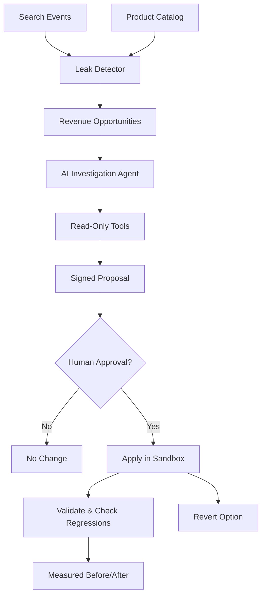

# Carcarah

**AI Agent for Finding and Recovering Lost E-commerce Search Opportunities**

> Autonomous search intelligence that detects revenue leaks, investigates root causes, and proposes safe, validated fixes — all with human approval.

[](https://carcarah.vercel.app)
[](#)
[](https://github.com/your-repo/carcarah)

---

## The Problem

E-commerce search is broken. Customers search using their own vocabulary — "moletom canguru preto" — but find nothing because the catalog uses different terms like "hoodie."

**The result?** Zero conversions. Lost revenue. Frustrated customers.

Traditional solutions require manual synonym rules, expensive consultants, or constant catalog updates. Most companies don't even know these leaks exist.

---

## The Solution: Carcarah

Carcarah is an **autonomous AI agent** that:

1. **Detects** revenue leaks automatically from search data
2. **Investigates** root causes using real-time tools and semantic reasoning
3. **Proposes** safe, reversible search fixes with confidence scores
4. **Validates** changes before showing results
5. **Requires human approval** for every action

### Before → After

```
Search: "moletom canguru preto"

❌ BEFORE
└─ 0 products found
   187 searches → 0 purchases
   Estimated lost revenue: R$ 8,400/month

        ↓ Carcarah investigates ↓
        
✅ AFTER  
└─ 2 products found
   Rule: "canguru" → "hoodie"
   Validated with 0 regressions
```

**See it in action:** Visit the [NOVA storefront demo](https://carcarah.vercel.app/storefront?q=moletom%20canguru%20preto&autosearch=1) before and after Carcarah's fix.

---

## How It Works

### 1. Detect Revenue Leaks

A deterministic analyzer processes search events and identifies queries with:
- High search volume
- Low conversion rates
- Estimated revenue opportunity

**Formula:**
```
Opportunity = searches × (baseline_cvr - current_cvr) × avg_order_value
```

### 2. Investigate with AI

When you click "Investigate," Carcarah autonomously:
- Queries the live storefront
- Searches the product catalog
- Tests vocabulary hypotheses
- Inspects product details

**Tools Used:**
- `getLeakContext` - Retrieves search metrics
- `searchStorefront` - Tests current search behavior
- `searchCatalog` - Explores catalog vocabulary
- `getProductDetails` - Validates products exist

**No guessing.** Every recommendation is grounded in real data.

### 3. Propose Safe Changes

Carcarah generates a **SearchActionProposal** with:
- Source term (user vocabulary)
- Target terms (catalog vocabulary)
- Confidence score
- Risk assessment (low/medium/high)
- Rationale

**Example:**
```json
{
  "type": "synonym_rule",
  "source": "canguru",
  "targets": ["hoodie"],
  "confidence": 0.92,
  "risk": "low",
  "reversible": true,
  "rationale": "Catalog uses 'hoodie' vocabulary; users search 'canguru'"
}
```

### 4. Human Approval Required

**Nothing changes without your approval.**

- Low-risk: Apply directly
- Medium-risk: Review and approve
- High-risk: Blocked by policy

Every action is cryptographically signed to prevent tampering.

### 5. Validate Before/After

Carcarah automatically:
- Applies the rule in an **isolated sandbox**
- Re-runs the original query
- Measures result improvement
- Checks healthy queries for regressions

**Validation trace:**
```
✓ Rule applied in sandbox
✓ Query re-tested: 0 → 2 products
✓ No regressions detected (6 queries checked)
✓ Change validated successfully
```

### 6. Revert Anytime

Made a mistake? Click "Revert" to restore original behavior instantly.

---

## Architecture



### Tech Stack

- **Framework:** Next.js 16 + React 19
- **AI:** OpenAI GPT-4o with Vercel AI SDK
- **Runtime:** Tool calling with structured output (Zod)
- **Styling:** CSS Modules + Motion
- **Testing:** Vitest
- **Type Safety:** TypeScript

### Key Design Principles

1. **Separation of Concerns**
   - Detect (deterministic) ≠ Investigate (agentic) ≠ Act (controlled)

2. **Read vs. Write**
   - Investigation tools: read-only
   - Act tools: single controlled write operation
   - No direct catalog/database modifications

3. **Grounding**
   - Every recommendation backed by tool results
   - No hallucinated products or rules

4. **Safety**
   - Signed proposals prevent tampering
   - Risk assessment on every action
   - Automatic regression detection
   - Sandbox-only changes (demo)

5. **Human in the Loop**
   - Explicit approval required
   - Full transparency of agent reasoning
   - Tool execution trace visible

---

## Running Locally

### Prerequisites

- Node.js 22+ and npm
- OpenAI API key (for AI investigation)

### Setup

```bash
# Install dependencies
npm install

# Configure environment
cp .env.example .env.local
# Add OPENAI_API_KEY to .env.local

# Start development server
npm run dev
```

Visit `http://localhost:3000`

### Quality Checks

```bash
# Run linter
npm run lint

# Run tests
npm test

# Build for production
npm run build
```

**All checks must pass** ✅

---

## Project Structure

```
carcarah/
├── src/
│   ├── app/                    # Next.js app router
│   │   ├── api/
│   │   │   ├── investigate/    # Agent investigation endpoint
│   │   │   ├── resolve/        # Apply/revert actions endpoint
│   │   │   └── storefront/     # Demo storefront API
│   │   ├── leaks/[query]/      # Leak detail pages
│   │   └── storefront/         # NOVA storefront demo
│   │
│   ├── lib/
│   │   ├── search-analysis/    # Deterministic leak detection
│   │   ├── investigation-agent/ # AI agent with tools
│   │   ├── search-actions/     # Act boundary (apply/revert)
│   │   ├── commerce-search/    # Search engine simulator
│   │   └── storefront-demo/    # Storefront session management
│   │
│   └── components/             # React components
│
├── data/
│   ├── products.json           # Simulated catalog
│   └── search-events.json      # Simulated analytics
│
└── tests/                      # Unit tests
```

---

## Demo Scenario

The demo simulates a real-world search problem:

### The Leak

**Query:** "moletom canguru preto"  
**Problem:** Vocabulary mismatch (user says "canguru," catalog says "hoodie")  
**Impact:** 187 searches, 0 purchases, ~R$ 8,400/month lost

### The Fix

1. Navigate to dashboard
2. Click **"Ver problema na loja ↗"** → see 0 results
3. Return and click **"Investigar com Carcarah"**
4. Watch agent use tools to diagnose the issue
5. Review proposal: `canguru → hoodie`
6. Click **"Aprovar e aplicar no sandbox"**
7. See validation: 0 → 2 products found
8. Click **"Ver resultado na loja →"** → see products!
9. (Optional) Click **"Reverter alteração"** → back to 0

---

## What Carcarah Does NOT Do

To maintain scope and stability for this hackathon submission:

❌ Does not connect to real e-commerce platforms (Shopify, VTEX, etc.)  
❌ Does not modify production catalogs or search engines  
❌ Does not use RAG, embeddings, or vector databases  
❌ Does not include authentication or multi-tenancy  
❌ Does not persist changes beyond the demo session

**This is intentional.** Carcarah demonstrates the core autonomous loop with real AI reasoning, safe controls, and measurable validation — without the complexity of production integrations.

---

## Future Roadmap

- [ ] Real analytics integrations (Google Analytics, Mixpanel)
- [ ] E-commerce platform connectors (Shopify, VTEX, WooCommerce)
- [ ] Multi-agent orchestration (product, inventory, pricing agents)
- [ ] A/B testing framework for rule deployment
- [ ] LLM-agnostic architecture (Claude, Gemini, Llama)
- [ ] Enterprise authentication and multi-tenant support
- [ ] Embeddings + semantic search for better rule discovery

---

## Disclaimer

**This is a hackathon demo.**

- All data is simulated
- GMV estimates are for demonstration only
- Applied rules exist only in the demo sandbox
- No real revenue is recovered
- Investigation requires OpenAI API access

For production use, integrate with real analytics, catalogs, and search infrastructure.

---

## License

MIT

---

## Team

Built for [Hackathon Name] by [Your Name/Team]

**Questions?** Open an issue or reach out at [contact]

---

**Ready to see it in action?**  
👉 [Try the live demo](https://carcarah.vercel.app)  
📹 [Watch the video](#)  
💻 [Explore the code](https://github.com/your-repo/carcarah)
