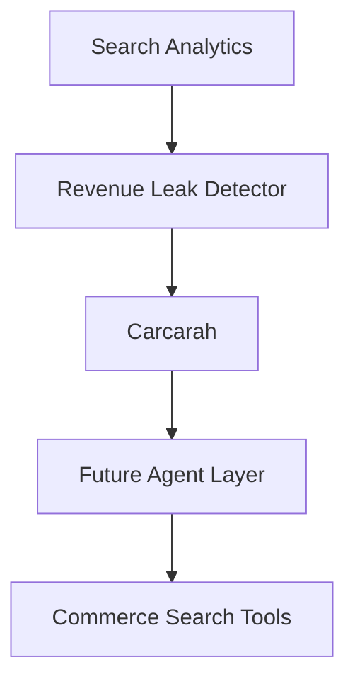

# Carcarah

Autonomous Search Revenue Recovery Agent.

## Problem

E-commerce stores lose revenue when high-intent searches return irrelevant results, poorly ranked products, or no useful result at all. The catalog may already contain a suitable product, but shoppers still fail to find and buy it.

## Vision

Carcarah will continuously:

**Observe → Detect → Investigate → Act → Validate → Measure**

This first milestone implements only **Observe + Detect**. It intentionally does not use an LLM, embeddings, tool calling, authentication, or an external database.

## Current demo

The demo contains 28 fictional fashion products and 22 aggregated search queries. The deterministic detector calculates engagement and conversion baselines from healthy queries, finds meaningful performance gaps, checks for related in-stock catalog items, assigns severity, and ranks leaks by estimated monthly GMV opportunity.

The primary demo case is `moletom canguru preto`: 187 searches, 2 clicks, and no purchases, despite related products being available in the catalog.

All data in the current demo is simulated.

## Architecture



- `data/`: simulated catalog and aggregated search events.
- `src/lib/search-analysis/`: pure TypeScript metrics, matching, detection, severity, and summary functions.
- `src/components/`: presentational dashboard components.
- `src/app/`: App Router dashboard and revenue leak detail route.

### Detection heuristic

A query becomes a candidate when it has at least 50 searches, conversion below 45% of the healthy-query baseline, and either low CTR or zero purchases. Severity combines:

- search volume;
- CTR gap versus baseline;
- conversion gap versus baseline;
- zero purchases;
- presence of matching in-stock catalog products.

No query string is hardcoded in the detector.

### Estimated opportunity

```text
searches × healthy-query baseline conversion rate × average in-stock product price
```

The detector clamps every input to zero or greater, so the result cannot be negative.

## Running locally

Requirements: Node.js 20.9 or newer and npm.

```bash
npm install
npm run dev
```

Open [http://localhost:3000](http://localhost:3000).

Quality checks:

```bash
npm run lint
npm test
npm run build
```

## Disclaimer

GMV opportunity metrics are estimates based on simulated search and catalog data. They do not represent recovered, guaranteed, or realized revenue.
